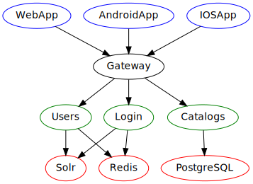
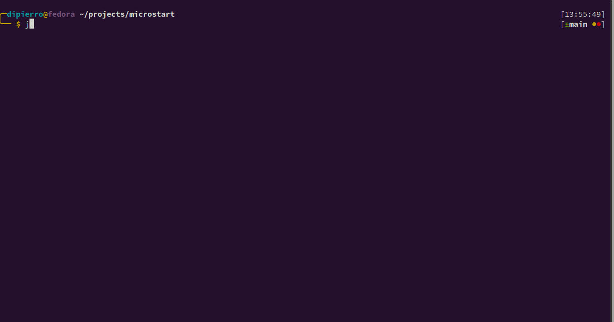
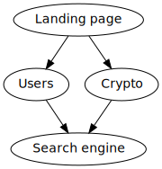

# microstart
CLI utility to start several processes in groups

If you are using a microservice architecture, this may come handy as it can various microservices with just some simple
lines 🚀.

This improves developer experience because you'll no longer need to open multiple terminals.

It is similar to docker compose, but these are the main differences:

- This does not require a docker container to be built. Any command you run from command line can be run here
- It supports process groups and dependencies (see below)

**It is intended to be used in development environment preferably**, since in production you have more pro stuff like
docker and k8s.

## Concepts

Note: **process** and **service** are used interchangeably here. This is because the main focus of the application is to
run services, but it actually can run any process you want

### Process groups

Suppose your application has the following dependency graph



Then, we can define 4 groups:

1. Databases (Redis, Solr, PostgreSQL)
2. Microservices (Users, Login, Catalogs)
3. Gateway (Gateway)
4. Frontend (WebApp, AndroidApp, IOSApp)

Group 4 depends on group 3, which in turn depends on group 2, which in turn depends on group 1.

You can write a JSON file containing the following configuration

```json
{
  "$schema": "https://raw.githubusercontent.com/BenjaminGuzman/microstart/main/src/main/resources/schema.json",
  "services": [],
  "groups": [
    {
      "name": "Frontend",
      "aliases": [
        "frontend",
        "front"
      ],
      "services": [
        "angular",
        "android-client",
        "ios-client"
      ],
      "dependencies": [
        "gateway"
      ]
    },
    {
      "name": "Gateway",
      "aliases": [
        "gate",
        "gateway"
      ],
      "services": [
        "gateway"
      ],
      "dependencies": [
        "microservices"
      ]
    },
    {
      "name": "Microservices",
      "aliases": [
        "microservices"
      ],
      "services": [
        "users",
        "login",
        "catalogs"
      ],
      "dependencies": [
        "databases"
      ]
    },
    {
      "name": "Databases",
      "aliases": [
        "databases",
        "db",
        "dbs"
      ],
      "services": [
        "solr",
        "redis",
        "postgres"
      ]
    }
  ],
  "continueAfterError": true
}
```

As you can see, each group has:

- `name`: Name of the group. Can be used to start the service group.
- `aliases`: Aliases for the name. Can be used to start the service group.
- `services`: List of services that should run with this group. **references services defined in the `services` array**
  (see below).
- `dependencies`: List of groups that should be run before this group is run. The group will not run<sup>1</sup> unless
  its dependencies have been run and successfully notified they have started

**It is allowed to have a group and a service with the same name (or aliases), but not 2 groups or services with the
same name (or aliases)**

<sup>1</sup> You can modify this behaviour with the `continueAfterError` key.

### Process / Service

As said before, each group runs a set of microservices (actually processes), and the key `services` is where you define
which command to run, among other stuff. For example:

```json
{
  "$schema": "https://raw.githubusercontent.com/BenjaminGuzman/microstart/main/src/main/resources/schema.json",
  "services": [
    {
      "name": "Web App",
      "aliases": [
        "web-app",
        "angular"
      ],
      "start": "npm run start",
      "color": "0xff0000",
      "workDir": "super-project/frontend/web",
      "startedPatterns": [
        "(service|server) is listening on http(s):\/\/"
      ],
      "errorPatterns": [
        "Error (happened|occurred|in)"
      ]
    },
    {
      "name": "Android App",
      "aliases": [
        "android-app",
        "android-client"
      ],
      "start": "echo Starting android client... Done.",
      "color": "0x00ff00",
      "workDir": "super-project/frontend/android",
      "startedPatterns": [
        "done"
      ]
    },
    {
      "name": "IOS App",
      "aliases": [
        "ios-app",
        "ios-client"
      ],
      "start": "echo Starting ios client... Done.",
      "workDir": "super-project/frontend/ios",
      "startedPatterns": [
        "done"
      ]
    },
    {
      "name": "Gateway",
      "aliases": [
        "gateway"
      ],
      "start": "echo Starting gateway... Gateway is up and running.",
      "workDir": "super-project/frontend/android",
      "startedPatterns": [
        "is up and running"
      ]
    },
    {
      "name": "Users",
      "aliases": [
        "users"
      ],
      "start": "node main.js",
      "workDir": "super-project/backend/users",
      "startedPatterns": [
        "(service|server) is listening"
      ]
    },
    ...rest
    of
    services...
  ],
  "groups": [
    {
      "name": "Frontend",
      "aliases": [
        "frontend",
        "front"
      ],
      "services": [
        "angular",
        "android-client",
        "ios-client"
      ],
      "dependencies": [
        "gateway"
      ]
    },
    {
      "name": "Gateway",
      "aliases": [
        "gate",
        "gateway"
      ],
      "services": [
        "gateway"
      ],
      "dependencies": [
        "microservices"
      ]
    },
    {
      "name": "Microservices",
      "aliases": [
        "microservices"
      ],
      "services": [
        "users",
        "login",
        "catalogs"
      ],
      "dependencies": [
        "databases"
      ]
    },
    {
      "name": "Databases",
      "aliases": [
        "databases",
        "db",
        "dbs"
      ],
      "services": [
        "solr",
        "redis",
        "postgres"
      ]
    }
  ],
  "continueAfterError": true
}
```

As you can see, each group has:

- `name`: Name of the group. Can be used to start the service or reference.
- `aliases`: Aliases for the name. Can be used to start the service.
- `start`: Command to run. If your OS allow it, you can specify multiple commands like `echo hello | less && echo bye`
- `color`: Color to use when piping output from the process' stdin/stderr to microstart stdout. This allows you to
  identify which output comes from which service. Color will only be displayed if your terminal supports it
- `workDir`: Working directory where the start command is going to be run.
- `startedPatterns`: List of patterns that will identify the service has started. These patterns are looked in the
  process' **stdout**
- `errorPatterns`: List of patterns that will identify the service failed to start. These patterns are looked in the
  process' **stderr**.

**Aliases and names are case-sensitive**, that's why *Gateway* has an alias *gateway*

## Usage

After you've defined you json configuration, you can run the application with

```shell
java -jar microstart.jar
```

With the following options

- `-c/--config`: Path to configuration file. Default: `./microstart.json`
- `-i/--input`: Initial input to process. This is just a shorthand so don't need to start the application and then enter
  the command

### Command line

When you start the application you'll see some help, so you can use it, it's very simple.

Here is a small demonstration of how to use it.



The video runs with the configuration file [example.json](./example.json)

Notice how **Search engine** service is run before anything else, then both **users** and **crypto** services run
concurrently, and finally **Landing page** is started.

The dependency graph for the example.json looks like this



## TODO's

Check [Projects](https://github.com/BenjaminGuzman/microstart/projects) tab

## Acknowledgements

### Libraries used

- [Apache Commons CLI](https://commons.apache.org/proper/commons-cli/)
- [JColor](https://github.com/dialex/JColor)
- [Jetbrains Annotations](https://www.jetbrains.com/help/idea/annotating-source-code.html)
- [JUnit 5](https://junit.org/junit5/)
- [JSON parser](https://mvnrepository.com/artifact/org.json/json)
- [JSON schema validator](https://github.com/everit-org/json-schema/)

## License

