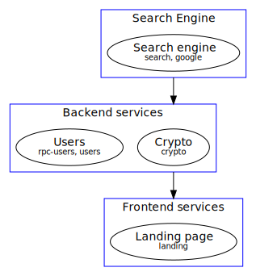

# microstart
CLI utility to start various processes in parallel with a start sequence.

It improves developer experience because **you'll no longer need to open multiple terminals**.

It is similar to docker compose, but these are the main differences:

- Doesn't need docker installed. Any command you run from command line can be run by this program
- It supports process groups and dependencies (see below)
- Can generate [dot code](https://graphviz.org/doc/info/lang.html) based on configuration

**It is intended to be used in development environment preferably**, since in production you have more pro stuff like
kubernetes.

## Feature overview

- Start **group processes** defined in configuration
- Configure dependencies in order to **start a process after** another has notified **successful startup**
- Start **single processes** defined in configuration
- Generate [**dot code**](https://graphviz.org/doc/info/lang.html) from configuration to get an overview of the
  dependency graph between microservices for your application

Here is a small demonstration


Notice how _Search engine_ service is run before anything else, then both _users_ and _crypto_ services run
concurrently, and, after both have notified successful startup, _Landing page_ is started.

Configuration file used in GIF is [example.json](./example.json) or [example.yml](./example.yml).
[schema.json](src/main/resources/schema.json) contains all configurable properties.

Generated dependency graph image:



## Concepts

### Process groups

Suppose your application has the following dependency graph


Then, we can define 4 groups:

1. Databases (Redis, Solr, PostgreSQL)
2. Microservices (Users, Login, Catalogs)
3. Gateway (Gateway)
4. Frontend (WebApp, AndroidApp, IOSApp)

Group 4 depends on group 3, which in turn depends on group 2, which in turn depends on group 1.

You can write a YAML or JSON file containing the following configuration

```yaml
services: [ ]
groups:
  - name: Frontend
    aliases:
      - frontend
      - front
    services:
      - angular
      - android-client
      - ios-client
    dependencies:
      - gateway

  - name: Gateway
    aliases:
      - gate
      - gateway
    services:
      - gateway
    dependencies:
      - microservices

  - name: Microservices
    aliases:
      - microservices
    services:
      - users
      - login
      - catalogs
    dependencies:
      - databases

  - name: Databases
    aliases:
      - databases
      - db
      - dbs
    services:
      - solr
      - redis
      - postgres

ignoreErrrors: true
```

As you can see, each group has:

- `name`: **required**. Name of the group. Can be used to start the service group.
- `aliases`: Aliases for the name. Can be used to start the service group.
- `services`: **required**. List of services that should run with this group. **references services defined in
  the `services` array** (see below).
- `dependencies`: List of groups that should be started before this group is started. 
  The group will not start<sup>1</sup> unless its dependencies have been run and successfully 
  notified they have started

<sup>1</sup> You can modify this behaviour with the `ignoreErrors` key.

It is allowed to have a group and a service with the same name or aliases, but not 2 groups or 2 services with the
same name or aliases

### Process

The property `services` is where you define the actual processes that will run when a group starts.
Example:

```yaml
services:
  - name: Web App
    aliases:
      - web-app
      - angular
    start: npm run start
    color: 0xff0000
    workDir: super-project/frontend/web
    startedPatterns:
      - '(service|server) is listening on http(s)://'
    errorPatterns:
      - Error (happened|occurred|in)
    stdin: web-app-stdin.txt
    stop: SIGTERM

  - name: Android App
    aliases:
      - android-app
      - android-client
    start: echo Starting android client... Done.
    color: 0x00ff00
    workDir: super-project/frontend/android
    startedPatterns:
      - done

  - name: IOS App
    aliases:
      - ios-app
      - ios-client
    start: echo Starting ios client... Done.
    workDir: super-project/frontend/ios
    startedPatterns:
      - done

  - name: Gateway
    aliases:
      - gateway
    start: echo Starting gateway... Gateway is up and running.
    workDir: super-project/frontend/android
    startedPatterns:
      - is up and running
    stop: systemctl stop custom-gateway-service
    stopTimeout: 1

  - name: Users
    aliases:
      - users
    start: node main.js
    workDir: super-project/backend/users
    startedPatterns:
      - (service|server) is listening

groups:
  - name: Frontend
    aliases:
      - frontend
      - front
    services:
      - angular
      - android-client
      - ios-client
    dependencies:
      - gateway

  - name: Gateway
    aliases:
      - gate
      - gateway
    services:
      - gateway
    dependencies:
      - microservices

  - name: Microservices
    aliases:
      - microservices
    services:
      - users
      - login
      - catalogs
    dependencies:
      - databases

  - name: Databases
    aliases:
      - databases
      - db
      - dbs
    services:
      - solr
      - redis
      - postgres

ignoreErrors: true
```

For a full and detailed list of configurable properties of a service please see
[schema.json](src/main/resources/schema.json)

**Aliases and names are case-sensitive**, that's why *Gateway* has an alias *gateway*

**patterns** (`startedPatterns` and `errorPatterns`) **are case-insensitive**, and please note these patterns are
regular expressions (so, `inactive (dead)` is NOT the same as `inactive \(dead\)`)

**Once processes are started it is recommended to manage them inside microstart**, i.e. don't manage processes externally 
(don't send signals manually with kill command or so) because you may end up with orphan processes.
A concrete example of this is when you use `npm start` as the start command. Killing the npm process doesn't kill the 
nodejs process!

## YAML/JSON config properties

For all available JSON/YAML properties, description and constraints see [schema.json](src/main/resources/schema.json)

## Installation

[`install.sh`](install.sh) script is provided, simply execute it

## Dependencies

- [PicoCLI](https://picocli.info/): Parse CLI args and colorize output
- [Jetbrains Annotations](https://www.jetbrains.com/help/idea/annotating-source-code.html): Better code documentation
- [JUnit 5](https://junit.org/junit5/): Test framework
- [JSON parser](https://mvnrepository.com/artifact/org.json/json): Parse JSON
- [JSON schema validator](https://github.com/everit-org/json-schema/): Validate JSON with a defined schema
- [Snake YAML](https://bitbucket.org/asomov/snakeyaml/src): Convert from YAML (to `Map<String, Object>`) to JSON

## License


