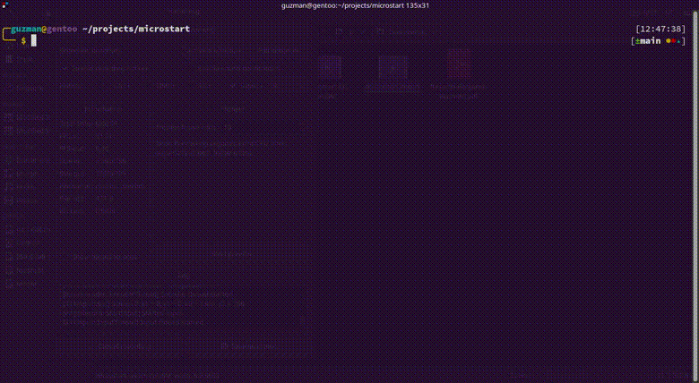

# microstart
CLI utility to start several processes in groups

If you are using a microservice architecture, this may come handy as it can various microservices with just some simple
lines 🚀.

This improves developer experience because you'll no longer need to open multiple terminals.

It is similar to docker compose, but these are the main differences:

- This does not require a docker container to be built. Any command you run from command line can be run by this program
- It supports process groups and dependencies (see below)
- Can generate [dot code](https://graphviz.org/doc/info/lang.html) based on configuration

**It is intended to be used in development environment preferably**, since in production you have more pro stuff like
k8s.

## Feature overview

- Start **group processes** defined in configuration
- Configure dependencies in order to **start a process after** another has notified **successful startup**
- Start **single processes** defined in configuration
- Generate [**dot code**](https://graphviz.org/doc/info/lang.html) from configuration to get an overview of the
  dependency graph between microservices for your application

Here is a small demonstration



**It can handle both JSON and YAML configuration**, configuration file used in the GIF is [example.json](./example.json)
or [example.yml](./example.yml).

Notice how **Search engine** service is run before anything else, then both **users** and **crypto** services run
concurrently, and, after both have notified successful startup, **Landing page** is started.

Generated svg file shown in the GIF is the following


## Concepts

Note: **process** and **service** are used interchangeably here. This is because the main focus of the application is to
run services, but it actually can run any process you want

### Process groups

Suppose your application has the following dependency graph


Then, we can define 4 groups:

1. Databases (Redis, Solr, PostgreSQL)
2. Microservices (Users, Login, Catalogs)
3. Gateway (Gateway)
4. Frontend (WebApp, AndroidApp, IOSApp)

Group 4 depends on group 3, which in turn depends on group 2, which in turn depends on group 1.

You can write a **YAML** or **JSON** file containing the following configuration

```yaml
services: [ ]
groups:
  - name: Frontend
    aliases:
      - frontend
      - front
    services:
      - angular
      - android-client
      - ios-client
    dependencies:
      - gateway

  - name: Gateway
    aliases:
      - gate
      - gateway
    services:
      - gateway
    dependencies:
      - microservices

  - name: Microservices
    aliases:
      - microservices
    services:
      - users
      - login
      - catalogs
    dependencies:
      - databases

  - name: Databases
    aliases:
      - databases
      - db
      - dbs
    services:
      - solr
      - redis
      - postgres

ignoreErrrors: true
```

As you can see, each group has:

- `name`: **required**. Name of the group. Can be used to start the service group.
- `aliases`: Aliases for the name. Can be used to start the service group.
- `services`: **required**. List of services that should run with this group. **references services defined in
  the `services` array**
  (see below).
- `dependencies`: List of groups that should be run before this group is run. The group will not run<sup>1</sup> unless
  its dependencies have been run and successfully notified they have started

<sup>1</sup> You can modify this behaviour with the `ignoreErrors` key.

**It is allowed to have a group and a service with the same name (or aliases), but not 2 groups or 2 services with the
same name (or aliases)**

### Process / Service

As said before, each group runs a set of microservices (actually processes), and the key `services` is where you define
which command to run, among other stuff. For example:

```yaml
services:
  - name: Web App
    aliases:
      - web-app
      - angular
    start: npm run start
    color: 0xff0000
    workDir: super-project/frontend/web
    startedPatterns:
      - '(service|server) is listening on http(s)://'
    errorPatterns:
      - Error (happened|occurred|in)

  - name: Android App
    aliases:
      - android-app
      - android-client
    start: echo Starting android client... Done.
    color: 0x00ff00
    workDir: super-project/frontend/android
    startedPatterns:
      - done

  - name: IOS App
    aliases:
      - ios-app
      - ios-client
    start: echo Starting ios client... Done.
    workDir: super-project/frontend/ios
    startedPatterns:
      - done

  - name: Gateway
    aliases:
      - gateway
    start: echo Starting gateway... Gateway is up and running.
    workDir: super-project/frontend/android
    startedPatterns:
      - is up and running

  - name: Users
    aliases:
      - users
    start: node main.js
    workDir: super-project/backend/users
    startedPatterns:
      - (service|server) is listening

groups:
  - name: Frontend
    aliases:
      - frontend
      - front
    services:
      - angular
      - android-client
      - ios-client
    dependencies:
      - gateway

  - name: Gateway
    aliases:
      - gate
      - gateway
    services:
      - gateway
    dependencies:
      - microservices

  - name: Microservices
    aliases:
      - microservices
    services:
      - users
      - login
      - catalogs
    dependencies:
      - databases

  - name: Databases
    aliases:
      - databases
      - db
      - dbs
    services:
      - solr
      - redis
      - postgres

ignoreErrors: true
```

As you can see, each group has:

- `name`: **required**. Name of the group. Can be used to start the service or reference it.
- `aliases`: Aliases for the name. Can be used to start the service.
- `start`: **required**. Command to run. If your OS allow it, you can specify multiple commands
  like `echo hello | less && echo bye`
- `color`: Color to use when piping output from the process' stdin/stderr to microstart stdout. This allows you to
  identify which output comes from which service. Color will only be displayed if your terminal supports it
- `workDir`: Working directory where the start command is going to be run.
- `startedPatterns`: List of patterns ([RegEx](https://docs.oracle.com/javase/tutorial/essential/regex/)) that will
  identify the service has started. These patterns are looked in the process' **stdout**. **Pro-tip**: if you think 
  microstart is broken because it just hangs after a service has "started", **double-check your RegEx**, 
  e.g. "active (running)" is not the same as "active \\(running\\)".
- `errorPatterns`: List of patterns ([RegEx](https://docs.oracle.com/javase/tutorial/essential/regex/)) that will
  identify the service failed to start. These patterns are looked in the process' **stderr**.

**Aliases and names are case-sensitive**, that's why *Gateway* has an alias *gateway*

[CASE_INSENSITIVE](https://docs.oracle.com/en/java/javase/17/docs/api/java.base/java/util/regex/Pattern.html#CASE_INSENSITIVE)
flag is **added to all patterns** (both `startedPatterns` and `errorPatterns`)

**Once processes are started it is recommended to manage them within microstart**, i.e. don't manage processes externally 
(don't send signals manually with kill command or so) because you may end up with orphan processes.
A concrete example of this is when you use `npm start` as the start command. Killing the npm process doesn't kill the 
nodejs process!

## YAML/JSON config properties

For all available JSON/YAML properties, description and constraints see [schema.json](src/main/resources/schema.json)

## Installation

[`install.sh`](install.sh) script is provided, simply execute it

## Usage

After you've defined your json/yaml configuration, you can run the application with

```shell
java -jar microstart.jar
```

With the following options

- `-c/--config`: Path to configuration file. Default: `microstart.yaml`
- `-i/--input`: Initial input to process. This is just a shorthand, so you don't need to start the application and then
  enter the command
- `-e/--ignore-errors`: Tells if execution should be stopped when a service notifies an error has happened.
  Overrides `ignoreErrors` key in config file

### Command line

When you start the application you'll see some help, so you can use it, it's very simple.

## TODO's

Check [Projects](https://github.com/BenjaminGuzman/microstart/projects) tab

## Dependencies

- [PicoCLI](https://picocli.info/): Parse CLI args and colorize output
- [Jetbrains Annotations](https://www.jetbrains.com/help/idea/annotating-source-code.html): Better code documentation
- [JUnit 5](https://junit.org/junit5/): Test framework
- [JSON parser](https://mvnrepository.com/artifact/org.json/json): Parse JSON
- [JSON schema validator](https://github.com/everit-org/json-schema/): Validate JSON with a defined schema
- [Snake YAML](https://bitbucket.org/asomov/snakeyaml/src): Convert from YAML (to `Map<String, Object>`) to JSON

## License


